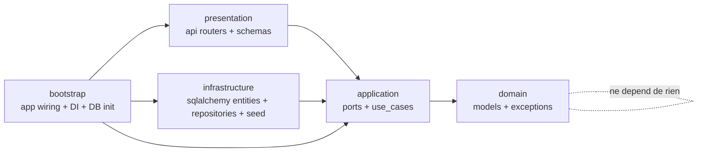

# 🐍 Création de l'environnement virtuel
```bash
python -m venv .venv
```
## Activation de l'environnement virtuel
### Sur Windows
```bash
.venv\Scripts\activate
```
### Sur macOS/Linux
```bash
source .venv/bin/activate
```

# 📦 Installation des dépendances
```bash
pip install -r requirements.txt
```
Packages utilisés :
- fastapi : framework web pour créer des API
- uvicorn : serveur ASGI pour exécuter l'application FastAPI
- sqlalchemy : ORM pour interagir avec la base de données
- pytest : framework de test pour Python
- sqlite3 : base de données locale (incluse avec Python)

# 💾 Base de données
Par défaut, l'application utilise SQLite avec le fichier `reminders.db` à la racine du projet.

Pour surcharger l'URL de connexion, utilisez la variable d'environnement `DATABASE_URL`.

# 🧱 Architecture CLEAN
- `domain/` : modèles métier et exceptions du domaine
- `application/` : ports (in/out) et cas d'usage
- `infrastructure/` : persistance SQLAlchemy (entités, repositories, seed)
- `presentation/` : routeurs FastAPI et schémas API
- `bootstrap/` : composition de l'application (DB, dépendances, handlers)
- `main.py` : point d'entrée minimal qui expose `app`

## Diagramme des dependances


Regles de dependances:
- `domain` ne depend d'aucune autre couche
- `application` depend de `domain` et de ses ports
- `infrastructure` implemente les ports sortants de `application`
- `presentation` utilise les ports entrants de `application`
- `bootstrap` assemble les implementations concretes

## Conventions de nommage
- Fichiers Python: `snake_case.py`
- Classes: `PascalCase`
- Ports entrants: `application/ports/inbound/<feature>_service.py` avec interface `<Feature>Service`
- Ports sortants: `application/ports/outbound/<feature>_repository.py` avec interface `<Feature>Repository`
- Cas d'usage: `application/use_cases/<feature>_service.py` avec implementation `<Feature>ServiceImpl`
- Repositories SQLAlchemy: `infrastructure/persistence/sqlalchemy/repositories/sqlalchemy_<feature>_repository.py`
- Routeurs API: `presentation/api/routers/<feature>_router.py`
- Schemas API: `presentation/api/schemas/<feature>.py` avec suffixes `Dto`, `PostDto`, `PutDto`, `PatchDto`
- Tests: `tests/<couche>/.../<unit_under_test>_test.py`, classes `Test...`, fonctions `test_...`

# 🚀 Démarrage de l'application
```bash
uvicorn main:app --reload
```
Urls :
- http://localhost:8000/docs : documentation interactive de l'API
- http://localhost:8000/redoc : documentation statique de l'API
- http://localhost:8000/todo : exemple d'appel à l'API
- http://localhost:8000/category : exemple d'appel à l'API
- http://localhost:8000/statistics : statistiques todos/categories

# 🧪 Exécution des tests
```bash
python -m pytest tests/ -v
```