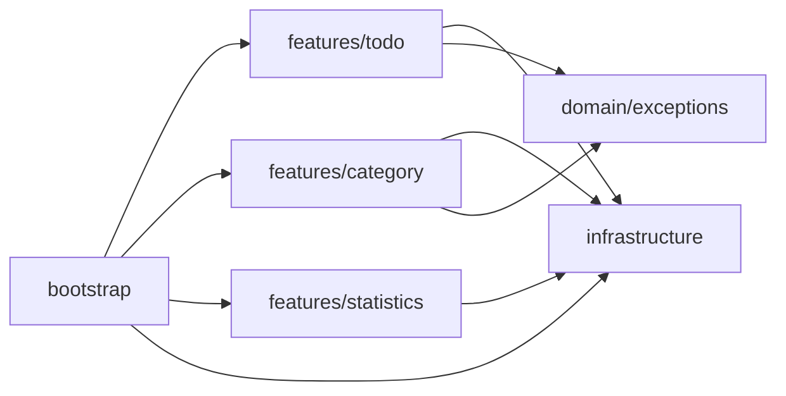

# 🐍 Création de l'environnement virtuel
```bash
python -m venv .venv
```
## Activation de l'environnement virtuel
### Sur Windows
```bash
.venv\Scripts\activate
```
### Sur macOS/Linux
```bash
source .venv/bin/activate
```

# 📦 Installation des dépendances
```bash
pip install -r requirements.txt
```
Packages utilisés :
- fastapi : framework web pour créer des API
- uvicorn : serveur ASGI pour exécuter l'application FastAPI
- sqlalchemy : ORM pour interagir avec la base de données
- pytest : framework de test pour Python
- sqlite3 : base de données locale (incluse avec Python)

# 💾 Base de données
Par défaut, l'application utilise SQLite avec le fichier `reminders.db` à la racine du projet.

Pour surcharger l'URL de connexion, utilisez la variable d'environnement `DATABASE_URL`.

# 🧱 Architecture Vertical Slices
- `features/todo/` : endpoints, schemas et logique métier de la fonctionnalité todo
- `features/category/` : endpoints, schemas et logique métier de la fonctionnalité category
- `features/statistics/` : endpoints et requêtes statistiques
- `features/shared/` : ré-export léger des dépendances partagées entre slices
- `infrastructure/` : engine SQLAlchemy (`db.py`), entités ORM, seed de données
- `bootstrap/` : création de l'application FastAPI, schema DB, handlers globaux
- `domain/exceptions/` : exception métier partagée (`ReminderError`)
- `main.py` : point d'entrée minimal qui expose `app`

## Diagramme des dependances


Regles de dependances:
- chaque dossier dans `features/` regroupe son routeur, ses schemas et sa logique
- une fonctionnalité peut accéder directement à la base via SQLAlchemy si cela sert bien la slice
- `statistics` illustre ce choix : lecture directe en base, sans service ni repository intermédiaire
- `bootstrap` assemble uniquement l'application et les composants transverses

## Conventions de nommage
- Fichiers Python: `snake_case.py`
- Classes: `PascalCase`
- Une feature vit dans `features/<feature>/`
- Routeur d'une feature: `features/<feature>/router.py`
- Schemas d'une feature: `features/<feature>/schemas.py`
- Logique d'une feature: `features/<feature>/slice.py`
- Dépendances mutualisées légères: `features/shared/*.py`
- Tests: `tests/features/<feature>/<feature>_slice_test.py`, classes `Test...`, fonctions `test_...`

# 🚀 Démarrage de l'application
```bash
uvicorn main:app --reload
```
Urls :
- http://localhost:8000/docs : documentation interactive de l'API
- http://localhost:8000/redoc : documentation statique de l'API
- http://localhost:8000/todo : exemple d'appel à l'API
- http://localhost:8000/category : exemple d'appel à l'API
- http://localhost:8000/statistics : statistiques todos/categories

# 🧪 Exécution des tests
```bash
python -m pytest tests/ -v
```